# Resin Kalaakari — Architecture

This document tracks the app's architecture as it's reviewed and refactored,
phase by phase (see project review plan). Each phase extends the diagram
below rather than replacing it, so by the final phase it reflects the full
end-to-end flow of the app.

## Diagram

```mermaid
flowchart LR
Browser[Browser] -->|"1: request + cookies"| Proxy["proxy.ts (auth gate)"]
Proxy -->|"2: verify session"| Supabase[(Supabase)]
Supabase -->|"3: user + refreshed token, if needed"| Proxy
Proxy -->|"4a: unauthenticated + protected route: /login?next=path"| Redirect["/login"]
Proxy -->|"4b: authorized or public route"| Vercel["Vercel (Next.js Server)"]
Vercel -->|"Server Components: createServerSupabaseClient()"| Supabase
Vercel -->|"Client Components (e.g. Navbar): client()"| Supabase
Vercel -->|"unmatched route"| NotFound["not-found.tsx"]
Vercel -->|"HTML + Set-Cookie"| Browser
Redirect -.->|"redirect response"| Browser
Vercel -->|"/login, /signup"| AuthPages["Login.tsx + SignUp.tsx (client)"]
AuthPages -->|"signInWithPassword, signUp, resetPasswordForEmail"| Supabase
AuthPages -->|"Google button: signInWithOAuth"| Google[Google]
Google -->|"code"| Callback["/auth/callback (route.ts)"]
Supabase -->|"confirmation or recovery email"| Email[Email link]
Email -->|"token_hash + type + next"| Callback
Callback -->|"exchangeCodeForSession or verifyOtp"| Supabase
Callback -->|"recovery: next = /auth/reset-password"| ResetPage["/auth/reset-password (page.tsx + ResetPassword.tsx)"]
Callback -->|"other success: safe next, or /"| Home["/ (home)"]
Callback -.->|"failure: /login?error=auth_failed"| Redirect
ResetPage -->|"getUser() guard"| Supabase
ResetPage -.->|"no user"| Redirect
ResetPage -->|"updateUser, then /"| Home
Vercel -->|"/"| Home
Home -->|"renders immediately"| HomeStatic["Hero + Testimonials (Server Components)"]
HomeStatic -->|"only client piece"| Carousel["Carousel (client: slide state + autoplay timer)"]
Home -->|"one Suspense per section"| HomeSections["FeaturedProducts, ShopByCategory, Gallery (async Server Components)"]
HomeSections -.->|"fallback while streaming"| SectionSkeleton["LoadingUI variant=section"]
HomeSections -->|"getFeaturedProducts, getCategories(7), getGalleryProducts"| DataLayer["lib/data (products.ts, categories.ts, orders.ts, profile.ts)"]
HomeSections -.->|"query fails: inline message or section hidden"| Home
Vercel -->|"/products?category, search, sort, page"| ProductsPage["products/page.tsx (Server Component)"]
ProductsPage -->|"raw searchParams"| ParseQuery["parseProductsQuery (lib/search-params.ts)"]
ParseQuery -->|"clean ProductsQuery"| ProductsPage
ProductsPage -->|"getProducts + getCategories (Promise.all)"| DataLayer
DataLayer -->|"createServerSupabaseClient: filters, range, count exact"| Supabase
ProductsPage -.->|"page past the end: redirect to last page"| ProductsPage
ProductsPage -->|"page links"| Pagination["PaginationControls (plain Links)"]
Vercel -.->|"while data loads"| Loading["loading.tsx + Spinner"]
Vercel -->|"/products/slug"| DetailPage["products/slug/page.tsx (Server Component)"]
DetailPage -->|"getProductBySlug (cache), getRelatedProducts"| DataLayer
DetailPage -.->|"no product: notFound()"| SlugNotFound["products/slug/not-found.tsx + NotFoundUI"]
DetailPage -->|"only client piece"| AddToCart["AddToCartButton (client, disabled until cart is ready)"]
AddToCart -->|"addToCart(product)"| CartCtx["CartProvider (root layout, client)"]
DataLayer -.->|"throws on Supabase error"| ErrorBoundary["error.tsx + ErrorUI"]
ErrorBoundary -.->|"Try again: unstable_retry"| Vercel
CartCtx -->|"useSyncExternalStore: read + write"| CartStore["cart-storage.ts (localStorage copy, tagged with owner id)"]
CartCtx -->|"onAuthStateChange: who is signed in"| Supabase
CartCtx -->|"signed in, once per user: loadCartForUser (merge guest cart, larger quantity wins)"| CartData["lib/data/cart.ts (browser client passed in)"]
CartCtx -->|"each change: one-row write, queued one at a time"| CartData
CartData -->|"cart_items + products"| Supabase
CartData -.->|"write fails: reload from DB + message"| CartCtx
CartCtx -.->|"signed out or other owner: local copy wiped"| CartStore
Vercel -->|"/cart"| CartPage["cart/page.tsx (Server Component, metadata)"]
CartPage -->|"only client piece"| CartView["CartView (client: loader, empty, list, total)"]
CartView -->|"one card per line"| CartCard["CartCard (plus, minus, remove)"]
CartCard -->|"updateQuantity, removeFromCart"| CartCtx
CartView -->|"clearCart"| CartCtx
CartView -->|"Proceed to Checkout: router.push /checkout (guest is stopped by the proxy)"| Proxy
Redirect -.->|"next validated by safeNextPath"| AuthPages
AuthPages -->|"email login: push(next). Google: callback?next="| Home
Vercel -->|"/checkout"| CheckoutPage["checkout/page.tsx (Server Component: requireUser + getShippingDefaults)"]
CheckoutPage -->|"initialShipping"| CheckoutForm["Checkout (client: form + estimate, waits for cartReady)"]
CheckoutForm -->|"flushCart: wait for queued cart writes"| CartCtx
CheckoutForm -->|"placeOrder(shipping only)"| Actions["checkout/actions.ts (Server Actions: session check + re-validate)"]
Actions -->|"createOrder: rpc create_order"| DataLayer
DataLayer -->|"create_order: ONE transaction, prices from products, snapshot, clears cart_items"| Supabase
Actions -->|"orderId"| CheckoutForm
CheckoutForm -->|"clearCart (local copy), then push success?id="| SuccessPage
Vercel -->|"/checkout/success?id="| SuccessPage["success/page.tsx (Server Component: getOrderForPayment)"]
SuccessPage -.->|"missing or not yours: notFound()"| SuccessNotFound["success/not-found.tsx"]
SuccessPage -->|"PayableOrder"| SuccessUI["Success (client: UPI details, UTR form, confetti)"]
SuccessUI -->|"submitPayment(orderId, utr)"| Actions
Actions -->|"submitPaymentProof: rpc submit_payment_proof"| DataLayer
Supabase -.->|"orders UPDATE trigger: verifying_payment"| EmailFn["send-order-email edge function (Phase 8)"]
Vercel -->|"/my-orders"| MyOrdersPage["my-orders/page.tsx (Server Component: getMyOrders)"]
MyOrdersPage -->|"OrderSummary[]"| MyOrdersUI["MyOrders (Server Component, plain Links)"]
MyOrdersUI -->|"/my-orders/id"| OrderPage["my-orders/id/page.tsx (Server Component: getMyOrderById)"]
OrderPage -->|"OrderDetail"| OrderUI["MyOrderDetail (Server Component)"]
OrderPage -.->|"not found or not yours: notFound()"| OrderNotFound["my-orders/id/not-found.tsx"]
CheckoutPage -->|"requireUser: getUser verified on the server"| Supabase
MyOrdersPage -->|"requireUser, then getMyOrders (user_id filter + RLS)"| DataLayer
```

## Auth flows (Phase 2)

1. **Email + password login:** `Login.tsx` calls `signInWithPassword` with the browser client. The session cookie is set in the browser, then `router.push("/")` + `router.refresh()`. This flow never touches `/auth/callback`.
2. **Google login/signup:** `signInWithOAuth` sends the browser to Google, which returns to `/auth/callback?code=...`. The callback swaps the code for a session (`exchangeCodeForSession`). Supabase has no separate OAuth call for signup vs login.
3. **Email signup:** `signUp` sends a confirmation email. The link lands on `/auth/callback` with `token_hash` + `type`, and the callback runs `verifyOtp`. (Confirm-email is ON in this project, so signup does not create a session by itself.)
4. **Forgot password:** `resetPasswordForEmail` sends a recovery email. The link goes to `/auth/callback?token_hash=...&type=recovery&next=/auth/reset-password`. The callback runs `verifyOtp` (session cookie set on the server) and redirects to the reset page. The page checks `getUser()` on the server, the form calls `updateUser`, then the user is sent to `/`.
5. **Callback safety:** `next` is resolved against our own origin and ignored if it points anywhere else (blocks open redirects such as `//evil.com`). Any callback failure redirects to `/login?error=auth_failed`, which `Login.tsx` shows as a friendly message.

## Products flow (Phase 3)

1. **URL is the state:** `/products?category=&search=&sort=&page=`. `parseProductsQuery` cleans the raw params once; `buildProductsHref` builds every link back.
2. **Data layer:** `lib/data/products.ts` + `categories.ts` are the only Supabase code for products. `.range()` for the page, `{ count: "exact" }` for the total, `id` tie-breaker on sorting, `.or()` search over name + description.
3. **Errors:** data functions throw, `error.tsx` + `ErrorUI` catch. A page past the end redirects to the last page.
4. **Loading / not found:** `loading.tsx` uses the `Spinner` (fixed minimum height, so it can never disagree with the real page height); `notFound()` renders `NotFoundUI`.
5. **Detail page** is a Server Component; only `AddToCartButton` is client (uses the cart context).

## Home page (Phase 4)

1. **Shape:** `Hero` and `Testimonials` are static Server Components. `FeaturedProducts`, `ShopByCategory`, `Gallery` are async Server Components, each in its own `<Suspense>` with a `LoadingUI variant="section"` fallback. The three queries run at the same time and stream in independently.
2. **One client component:** `Carousel` (slide state, autoplay, pause on hover/focus, reduced-motion aware).
3. **Data:** `getFeaturedProducts`, `getGalleryProducts`, `getCategories(limit)`. No component calls Supabase directly.
4. **A broken section does not break the page:** each section catches the data-layer error (inline message, or hidden for Gallery) instead of sending the whole page to `error.tsx`.
5. **Known limit:** the home page renders on every request because the server client reads cookies; the data is public and could be cached later.

## Cart flow (Phase 5)

1. **Who owns what:** `CartProvider` (root layout, client) is the only code that changes the cart. `lib/cart.ts` holds the pure rules (validate, merge, sort, totals), `lib/cart-storage.ts` is the localStorage store, `lib/data/cart.ts` holds every Supabase call for the cart. The data functions take the Supabase client as an argument (the cart runs in the browser, so the server client used by products/categories does not apply).
2. **Source of truth:** a guest's cart lives only in localStorage. For a signed-in user the database (`cart_items`) is the truth, and localStorage keeps a copy tagged with the user's id (`ownerId`), so a reload paints the cart instantly while the database copy loads.
3. **Sign-in:** `loadCartForUser` runs once per user id (not per auth event; `SIGNED_IN` can fire again on tab focus). If the local copy is a guest cart it is merged into the saved cart: a product in both keeps the larger quantity, deleted products are dropped, name/price come from the database, and only changed rows are written. The database result then replaces the local copy. Larger-wins (not a sum) means running it twice, for example React Strict Mode or two tabs, gives the same cart.
4. **Ready flag:** `cartReady` is false until auth is known and, for a signed-in user, the load has finished. Cart changes are ignored before that (the buttons are disabled), so a click can never race the load.
5. **Changes:** each action updates the screen first, then writes one row (upsert or delete) through a queue that runs one write at a time. Each write sends the quantity the screen shows at that moment, so a late request cannot put an old number back. If a write fails, the cart is reloaded from the database and a message is shown.
6. **Sign-out:** a local copy that belongs to nobody-yet-known or to another account is hidden and wiped, so the next visitor on the same browser never sees or inherits it. The saved cart stays in the database for the next sign-in.
7. **Cart page:** `cart/page.tsx` is a Server Component (so it can set `metadata`); `CartView` is the client component with four states: load failed (retry), loading, empty, list with total. There is no route-level `loading.tsx` because the wait depends on client state, so `CartView` shows the `Spinner` itself.
8. **Known limits:** the cart is not live across devices (another device's change shows after reload). Prices in the cart are for display only; checkout must price the order on the server (Phase 6). A guest's cart can show an old price until sign-in refreshes it. `user` and `loading` still come from the cart context because Checkout, Success, MyOrders, Profile and Admin read them there.

## Orders flow (Phase 6)

1. **Three locks on every order page:** `proxy.ts` is the fast, optimistic gate (redirects a guest to `/login?next=<path>`). Each page then calls `requireUser()` (`lib/auth.ts`, uses `getUser()`, which Supabase verifies; `getSession()` only reads the cookie). The data layer filters by `user_id`, and RLS checks it again. A page never relies on only one of them.
2. **Return-to-page:** the proxy adds `?next=`, `app/login/page.tsx` cleans it with `safeNextPath` (same-site paths only, never `/login` itself), `Login.tsx` pushes there after email login or adds it to the Google callback URL. `/auth/callback` re-checks it with its origin test.
3. **Placing an order:** the browser sends only the shipping details to the `placeOrder` Server Action. The action re-validates (`parseShipping` + `validateShipping`), then calls the Postgres function `create_order` through `supabase.rpc`. The function reads the user's saved `cart_items`, takes each price from `products`, snapshots it in `order_items.price_at_purchase`, inserts the order and items and empties the cart, all in ONE transaction (a function body is atomic). Nothing the browser says about prices or users is used.
4. **Why a function and not two inserts:** supabase-js sends one HTTP request per query, so it cannot hold a transaction open across calls. Only the database can make several writes all-or-nothing.
5. **Why the old policies were dropped:** the old RLS only checked ownership (`auth.uid() = user_id`), not values, so a customer could insert an order with any total, or update their own order to any status, from the browser console. The direct INSERT policies on `orders` and `order_items` and the owner UPDATE policy on `orders` are removed, so the two functions are the only way to create an order or submit a payment reference. SELECT policies and the temporary admin policies are unchanged.
6. **Double clicks:** `create_order` locks the user's cart rows first (`for update`). Two simultaneous calls run one after the other; the second finds an empty cart and returns `cart_empty`.
7. **Cart and checkout:** `Checkout` waits for `cartReady` before it decides the cart is empty. Before placing the order it awaits `flushCart()` (new in `CartContext`, resolves when the write queue is idle) so the saved cart is current. After success it sets a ref, then calls `clearCart()` (local copy + a harmless repeat of the database delete) and goes to the success page.
8. **Payment proof:** `submitPayment` calls the function `submit_payment_proof`, which only works on the caller's own order while it is `pending`, accepts a 12-character letters/digits UTR, and sets just `transaction_id` and `status = verifying_payment`. The existing `send_order_email_on_payment` trigger still fires from that UPDATE.
9. **Pages:** `checkout/page.tsx`, `checkout/success/page.tsx`, `my-orders/page.tsx` and `my-orders/[id]/page.tsx` are Server Components that load their data through `lib/data/orders.ts` and `profile.ts`. `Checkout` and `Success` are client components (forms, clipboard, confetti); `MyOrders` and `MyOrderDetail` are Server Components. `loading.tsx` in `checkout/` and `my-orders/`, `not-found.tsx` in `checkout/success/` and `my-orders/[id]/`, errors go to the root `error.tsx`.
10. **Navbar** reads the user from `useCart()` instead of running its own auth listener.
11. **Known limits:** the checkout total is an estimate from the cart; the server total is the one charged and is shown on the success page. Stock is not checked and orders cannot be cancelled. The orders list is not paginated. The flat shipping fee exists in two places (`SHIPPING_FEE` for display, `c_shipping` in SQL). The UPI id and WhatsApp number are constants in `lib/constants.ts` (the edge function has its own copy, Phase 8).

## Config that lives outside the repo (Supabase dashboard)

- **Authentication → Email Templates → Reset Password:** the link must be `{{ .SiteURL }}/auth/callback?token_hash={{ .TokenHash }}&type=recovery&next=/auth/reset-password`. With the default `{{ .ConfirmationURL }}` template the reset link only works in the same browser that requested it.
- **Authentication → URL Configuration → Site URL** must be the real site address (used by `{{ .SiteURL }}` above). Testing locally means temporarily using `http://localhost:3000` or testing on the deployed site.
- **Confirm email** is ON (signup shows "check your email").
- A code comment in `SignUp.tsx` says a Postgres trigger copies the signup `full_name` metadata into a profiles table. The trigger is not in the repo, so verify it in Supabase.
- **RLS (Phase 4):** anonymous SELECT policies on `products` and `categories`, the columns `is_featured`, `is_gallery`, `gallery_order`, and the public storage bucket for product images.
- **Cart (Phase 5):** the `cart_items` table with columns `user_id`, `product_id`, `quantity`, a UNIQUE constraint on `(user_id, product_id)` (the upsert depends on it), and a foreign key `product_id` to `products(id)`. RLS must let a signed-in user select, insert, update and delete only their own rows (`user_id = auth.uid()`). None of this is in the repo, and it was read from the code, not checked in Supabase.
- **Orders (Phase 6), kept as `phase-6-orders.sql` outside the repo:** two functions in the `public` schema, both `SECURITY DEFINER` with `search_path = ''`, executable only by `authenticated` (revoked from `public` and `anon`): `create_order(p_full_name, p_phone, p_shipping_address, p_city, p_state, p_pincode) returns uuid` and `submit_payment_proof(p_order_id uuid, p_utr text) returns void`. Dropped policies: `orders` "Users can create their own orders" (INSERT) and "Users can update their own orders" (UPDATE), `order_items` "Users can insert their own order items" (INSERT) and the duplicate SELECT "Users can view their own order items". Still in place: all other SELECT policies and the temporary "Testing Admin View/Update" policies on `orders` (hardcoded admin id, replaced in Phase 7). `products.price` is `numeric`, but `create_order` refuses prices with paise because `orders.total_price` and `order_items.price_at_purchase` are integers.
- **Authentication → URL Configuration → Redirect URLs (Phase 6):** Google login now sends `/auth/callback?next=<path>`. Supabase only honours a `redirectTo` that matches this list and otherwise falls back to the Site URL, so if Google login stops returning to the page the user wanted, widen the callback entry (for example with a trailing wildcard). Not verified against a live project.

## Phase log

| Phase              | Status      | Notes                                                                                                                                                                                                                                                                                                                                                                                                                                                                                                                                                                                                                                                                                                                                                                                                                                                                                                                                                                                                                                                                                                                                                                                                                             |
| ------------------ | ----------- | --------------------------------------------------------------------------------------------------------------------------------------------------------------------------------------------------------------------------------------------------------------------------------------------------------------------------------------------------------------------------------------------------------------------------------------------------------------------------------------------------------------------------------------------------------------------------------------------------------------------------------------------------------------------------------------------------------------------------------------------------------------------------------------------------------------------------------------------------------------------------------------------------------------------------------------------------------------------------------------------------------------------------------------------------------------------------------------------------------------------------------------------------------------------------------------------------------------------------------- |
| Repo setup (CI/CD) | Done        | CI workflow (lint/format/type-check/build), branch protection on `main`, Vercel previews confirmed on PRs                                                                                                                                                                                                                                                                                                                                                                                                                                                                                                                                                                                                                                                                                                                                                                                                                                                                                                                                                                                                                                                                                                                         |
| 1 — Foundation     | Done        | Two Supabase clients (browser/server), proxy.ts (renamed from middleware.ts per Next 16) with route guards for /checkout, /my-orders, /admin (role check deferred to Phase 7), root layout + metadata/fonts, added not-found.tsx + NotFoundUI, fixed Navbar client()-in-render bug (build crash risk + resubscribe/logout bug)                                                                                                                                                                                                                                                                                                                                                                                                                                                                                                                                                                                                                                                                                                                                                                                                                                                                                                    |
| 2 — Auth           | Done        | Login/SignUp client components, /auth/callback route (code + token_hash flows), reset-password page with server-side session guard. Fixes: open redirect in callback (origin comparison), callback errors now reach the login page (?error=auth_failed), plain `<a>` to `<Link>` in SignUp, lazy Supabase client init, reset-redirect timer cleanup, recovery email routed through the callback (works across devices). Follow-ups: proxy redirects to plain /login with no `next` (return-to-page not built yet)                                                                                                                                                                                                                                                                                                                                                                                                                                                                                                                                                                                                                                                                                                                 |
| 3 — Products       | Done        | Products area on a typed data layer (`lib/data/products.ts`, `categories.ts`, `lib/types.ts`), URL-driven filters/search/sort/pagination (12 per page, `.range()` + `count: "exact"`), `cache()` on `getProductBySlug`, related products, `error.tsx` / `loading.tsx` / `not-found.tsx` with `ErrorUI` / `NotFoundUI`. Product detail is a Server Component with `AddToCartButton` as its only client piece. Loading uses the `Spinner` after a skeleton made the footer jump worse.                                                                                                                                                                                                                                                                                                                                                                                                                                                                                                                                                                                                                                                                                                                                              |
| 4 — Home           | Done        | Home page as Server Components: `FeaturedProducts`, `ShopByCategory`, `Gallery` each in its own `Suspense`. Added `getFeaturedProducts`, `getGalleryProducts`, `getCategories(limit)`. `Carousel` is the only client piece. Fixes: `ShopByCategory` returns null when empty, list markup, single `h1`, image priorities, `lucide-react` replaced by `react-icons`, no nested `main` in `NotFoundUI`.                                                                                                                                                                                                                                                                                                                                                                                                                                                                                                                                                                                                                                                                                                                                                                                                                              |
| 5 — Cart           | Done        | Cart rebuilt around one provider. Guest cart in localStorage; signed-in cart in `cart_items` with a tagged local copy. Sign-in merge is idempotent (larger quantity wins). Writes are optimistic, one row at a time, queued, with reload-on-failure. New: `lib/cart.ts`, `lib/cart-storage.ts`, `lib/data/cart.ts`, `CartView`. Fixed: `any` types, setState in effect, missing deps, unvalidated `JSON.parse`, guest and DB cart overwriting each other on login, cart surviving sign-out, button inside link. Follow-ups: Checkout must wait for `cartReady` and price on the server (Phase 6).                                                                                                                                                                                                                                                                                                                                                                                                                                                                                                                                                                                                                                 |
| 6 — Orders         | Done        | Checkout, success, My Orders and order detail rebuilt. Orders are created by the Postgres function `create_order` (one transaction, prices read from `products`, cart cleared in the same step) through a Server Action; payment references go through `submit_payment_proof`. The direct INSERT/UPDATE policies on `orders` and `order_items` were dropped, so a customer can no longer set their own price or status from the browser. `proxy.ts` now adds `?next=` and login returns the user to that page (`safeNextPath`). New: `lib/auth.ts`, `lib/checkout.ts`, `lib/orders.ts`, `lib/safe-next.ts`, `lib/data/orders.ts`, `lib/data/profile.ts`, `checkout/actions.ts`, `FormError`, `loading.tsx` and `not-found.tsx` files; `CartContext` gained `flushCart`. Fixed: hooks after an early return in Checkout, cart redirect firing before `cartReady`, no transaction, client-side pricing, browser-side order update on the success page, order queries in the browser, duplicate Navbar auth state, nested `main` elements, `alert()` popups. Follow-ups for Phase 7: admin role column and the temporary admin policies, `/profile` is not behind the proxy, no badge styles for `verifying_payment` / `in-process`. |
| 7 — Admin          | Not started |                                                                                                                                                                                                                                                                                                                                                                                                                                                                                                                                                                                                                                                                                                                                                                                                                                                                                                                                                                                                                                                                                                                                                                                                                                   |
| 8 — Edge function  | Not started |                                                                                                                                                                                                                                                                                                                                                                                                                                                                                                                                                                                                                                                                                                                                                                                                                                                                                                                                                                                                                                                                                                                                                                                                                                   |
