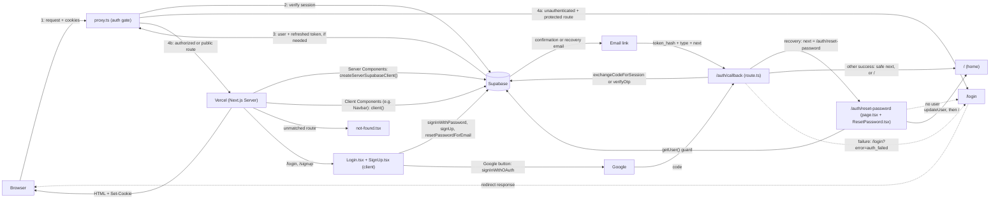

# Resin Kalaakari — Architecture

This document tracks the app's architecture as it's reviewed and refactored,
phase by phase (see project review plan). Each phase extends the diagram
below rather than replacing it, so by the final phase it reflects the full
end-to-end flow of the app.

## Diagram

## Auth flows (Phase 2)

1. **Email + password login:** `Login.tsx` calls `signInWithPassword` with the browser client. The session cookie is set in the browser, then `router.push("/")` + `router.refresh()`. This flow never touches `/auth/callback`.
2. **Google login/signup:** `signInWithOAuth` sends the browser to Google, which returns to `/auth/callback?code=...`. The callback swaps the code for a session (`exchangeCodeForSession`). Supabase has no separate OAuth call for signup vs login.
3. **Email signup:** `signUp` sends a confirmation email. The link lands on `/auth/callback` with `token_hash` + `type`, and the callback runs `verifyOtp`. (Confirm-email is ON in this project, so signup does not create a session by itself.)
4. **Forgot password:** `resetPasswordForEmail` sends a recovery email. The link goes to `/auth/callback?token_hash=...&type=recovery&next=/auth/reset-password`. The callback runs `verifyOtp` (session cookie set on the server) and redirects to the reset page. The page checks `getUser()` on the server, the form calls `updateUser`, then the user is sent to `/`.
5. **Callback safety:** `next` is resolved against our own origin and ignored if it points anywhere else (blocks open redirects such as `//evil.com`). Any callback failure redirects to `/login?error=auth_failed`, which `Login.tsx` shows as a friendly message.

## Config that lives outside the repo (Supabase dashboard)

- **Authentication → Email Templates → Reset Password:** the link must be `{{ .SiteURL }}/auth/callback?token_hash={{ .TokenHash }}&type=recovery&next=/auth/reset-password`. With the default `{{ .ConfirmationURL }}` template the reset link only works in the same browser that requested it.
- **Authentication → URL Configuration → Site URL** must be the real site address (used by `{{ .SiteURL }}` above). Testing locally means temporarily using `http://localhost:3000` or testing on the deployed site.
- **Confirm email** is ON (signup shows "check your email").
- A code comment in `SignUp.tsx` says a Postgres trigger copies the signup `full_name` metadata into a profiles table. The trigger is not in the repo, so verify it in Supabase.

## Phase log

| Phase              | Status      | Notes                                                                                                                                                                                                                                                                                                                                                                                                                                                                                                             |
| ------------------ | ----------- | ----------------------------------------------------------------------------------------------------------------------------------------------------------------------------------------------------------------------------------------------------------------------------------------------------------------------------------------------------------------------------------------------------------------------------------------------------------------------------------------------------------------- |
| Repo setup (CI/CD) | Done        | CI workflow (lint/format/type-check/build), branch protection on `main`, Vercel previews confirmed on PRs                                                                                                                                                                                                                                                                                                                                                                                                         |
| 1 — Foundation     | Done        | Two Supabase clients (browser/server), proxy.ts (renamed from middleware.ts per Next 16) with route guards for /checkout, /my-orders, /admin (role check deferred to Phase 7), root layout + metadata/fonts, added not-found.tsx + NotFoundUI, fixed Navbar client()-in-render bug (build crash risk + resubscribe/logout bug)                                                                                                                                                                                    |
| 2 — Auth           | Done        | Login/SignUp client components, /auth/callback route (code + token_hash flows), reset-password page with server-side session guard. Fixes: open redirect in callback (origin comparison), callback errors now reach the login page (?error=auth_failed), plain `<a>` to `<Link>` in SignUp, lazy Supabase client init, reset-redirect timer cleanup, recovery email routed through the callback (works across devices). Follow-ups: proxy redirects to plain /login with no `next` (return-to-page not built yet) |
| 3 — Products       | Not started |                                                                                                                                                                                                                                                                                                                                                                                                                                                                                                                   |
| 4 — Home           | Not started |                                                                                                                                                                                                                                                                                                                                                                                                                                                                                                                   |
| 5 — Cart           | Not started |                                                                                                                                                                                                                                                                                                                                                                                                                                                                                                                   |
| 6 — Orders         | Not started |                                                                                                                                                                                                                                                                                                                                                                                                                                                                                                                   |
| 7 — Admin          | Not started |                                                                                                                                                                                                                                                                                                                                                                                                                                                                                                                   |
| 8 — Edge function  | Not started |                                                                                                                                                                                                                                                                                                                                                                                                                                                                                                                   |
