# Resin Kalaakaari — Architecture

This document tracks the app's architecture as it was reviewed and refactored,
phase by phase. Each phase extended the diagram below rather than replacing
it. After Phase 10 it is the full end-to-end flow of the app, from the browser
to the invoice email and the admin product screens.

## Diagram

```mermaid
flowchart LR
Browser[Browser] -->|"1: request + cookies"| Proxy["proxy.ts (first gate: /checkout, /my-orders, /profile, /admin)"]
Proxy -->|"2: verify session"| Supabase[(Supabase)]
Supabase -->|"3: user + refreshed token, if needed"| Proxy
Proxy -->|"4a: unauthenticated + protected route: /login?next=path"| Redirect["/login"]
Proxy -->|"4b: authorized or public route"| Vercel["Vercel (Next.js Server)"]
Vercel -->|"Server Components: createServerSupabaseClient()"| Supabase
Vercel -->|"Client Components (e.g. Navbar): client()"| Supabase
Vercel -->|"unmatched route"| NotFound["not-found.tsx"]
Vercel -->|"HTML + Set-Cookie"| Browser
Redirect -.->|"redirect response"| Browser
Vercel -->|"/login, /signup"| AuthPages["Login.tsx + SignUp.tsx (client)"]
AuthPages -->|"signInWithPassword, signUp, resetPasswordForEmail"| Supabase
AuthPages -->|"Google button: signInWithOAuth"| Google[Google]
Google -->|"code"| Callback["/auth/callback (route.ts)"]
Supabase -->|"confirmation or recovery email"| Email[Email link]
Email -->|"token_hash + type + next"| Callback
Callback -->|"exchangeCodeForSession or verifyOtp"| Supabase
Callback -->|"recovery: next = /auth/reset-password"| ResetPage["/auth/reset-password (page.tsx + ResetPassword.tsx)"]
Callback -->|"other success: safe next, or /"| Home["/ (home)"]
Callback -.->|"failure: /login?error=auth_failed"| Redirect
ResetPage -->|"getUser() guard"| Supabase
ResetPage -.->|"no user"| Redirect
ResetPage -->|"updateUser, then /"| Home
Vercel -->|"/"| Home
Home -->|"renders immediately"| HomeStatic["Hero + Testimonials (Server Components)"]
HomeStatic -->|"only client piece"| Carousel["Carousel (client: slide state + autoplay timer)"]
Home -->|"one Suspense per section"| HomeSections["FeaturedProducts, ShopByCategory, Gallery (async Server Components)"]
HomeSections -.->|"fallback while streaming"| SectionSkeleton["LoadingUI variant=section"]
HomeSections -->|"getFeaturedProducts, getCategories(7), getGalleryProducts"| DataLayer["lib/data (products.ts, categories.ts, orders.ts, profile.ts, admin.ts, admin-orders.ts)"]
HomeSections -.->|"query fails: inline message or section hidden"| Home
Vercel -->|"/products?category, search, sort, page"| ProductsPage["products/page.tsx (Server Component)"]
ProductsPage -->|"raw searchParams"| ParseQuery["parseProductsQuery (lib/search-params.ts)"]
ParseQuery -->|"clean ProductsQuery"| ProductsPage
ProductsPage -->|"getProducts + getCategories (Promise.all)"| DataLayer
DataLayer -->|"createServerSupabaseClient: filters, range, count exact"| Supabase
ProductsPage -.->|"page past the end: redirect to page 1"| ProductsPage
ProductsPage -->|"page links"| Pagination["PaginationControls (plain Links)"]
Vercel -.->|"while data loads"| Loading["loading.tsx + Spinner"]
Vercel -->|"/products/slug"| DetailPage["products/slug/page.tsx (Server Component)"]
DetailPage -->|"getProductBySlug (cache), getRelatedProducts"| DataLayer
DetailPage -.->|"no product: notFound()"| SlugNotFound["products/slug/not-found.tsx + NotFoundUI"]
DetailPage -->|"only client piece"| AddToCart["AddToCartButton (client, disabled until cart is ready)"]
AddToCart -->|"addToCart(product)"| CartCtx["CartProvider (root layout, client)"]
DataLayer -.->|"throws on Supabase error"| ErrorBoundary["error.tsx + ErrorUI"]
ErrorBoundary -.->|"Try again: unstable_retry"| Vercel
CartCtx -->|"useSyncExternalStore: read + write"| CartStore["cart-storage.ts (localStorage copy, tagged with owner id)"]
CartCtx -->|"onAuthStateChange: who is signed in"| Supabase
CartCtx -->|"signed in, once per user: loadCartForUser (merge guest cart, larger quantity wins)"| CartData["lib/data/cart.ts (browser client passed in)"]
CartCtx -->|"each change: one-row write, queued one at a time"| CartData
CartData -->|"cart_items + products"| Supabase
CartData -.->|"write fails: reload from DB + message"| CartCtx
CartCtx -.->|"signed out or other owner: local copy wiped"| CartStore
Vercel -->|"/cart"| CartPage["cart/page.tsx (Server Component, metadata)"]
CartPage -->|"only client piece"| CartView["CartView (client: loader, empty, list, total)"]
CartView -->|"one card per line"| CartCard["CartCard (plus, minus, remove)"]
CartCard -->|"updateQuantity, removeFromCart"| CartCtx
CartView -->|"clearCart"| CartCtx
CartView -->|"Proceed to Checkout: router.push /checkout (guest is stopped by the proxy)"| Proxy
Redirect -.->|"next validated by safeNextPath"| AuthPages
AuthPages -->|"email login: push(next). Google: callback?next="| Home
Vercel -->|"/checkout"| CheckoutPage["checkout/page.tsx (Server Component: requireUser + getShippingDefaults)"]
CheckoutPage -->|"initialShipping"| CheckoutForm["Checkout (client: form + estimate, waits for cartReady)"]
CheckoutForm -->|"flushCart: wait for queued cart writes"| CartCtx
CheckoutForm -->|"placeOrder(shipping only)"| Actions["checkout/actions.ts (Server Actions: session check + re-validate)"]
Actions -->|"createOrder: rpc create_order"| DataLayer
DataLayer -->|"create_order: ONE transaction, prices from products, snapshot, clears cart_items"| Supabase
Actions -->|"orderId"| CheckoutForm
CheckoutForm -->|"clearCart (local copy), then push success?id="| SuccessPage
Vercel -->|"/checkout/success?id="| SuccessPage["success/page.tsx (Server Component: getOrderForPayment)"]
SuccessPage -.->|"missing or not yours: notFound()"| SuccessNotFound["success/not-found.tsx"]
SuccessPage -->|"PayableOrder"| SuccessUI["Success (client: UPI details, UTR form, confetti)"]
SuccessUI -->|"submitPayment(orderId, utr)"| Actions
Actions -->|"submitPaymentProof: rpc submit_payment_proof"| DataLayer
DataLayer -->|"submit_payment_proof: own pending order only, 12-char UTR, sets status verifying_payment"| Supabase
Supabase -->|"orders UPDATE: status becomes verifying_payment (only the customer can do this)"| Trigger["trigger send_order_email_on_verifying: AFTER UPDATE OF status, WHEN new = verifying_payment and old is not"]
Trigger -->|"notify_order_email, SECURITY DEFINER"| Queue["queue_order_email(order id)"]
Queue -->|"reads the shared secret at call time"| Vault[("Vault: send_order_email_secret, random, made by Postgres")]
Queue -->|"POST with order_id only + x-webhook-secret header"| PgNet["pg_net: async, sends after commit, waits up to 30 s"]
Queue -.->|"cannot queue: warning + failed rows, the customer update still succeeds"| EmailLog
PgNet -->|"HTTPS"| EmailFn["send-order-email edge function (Deno, verify_jwt = false)"]
EmailFn -.->|"no or wrong secret: 401, nothing sent"| PgNet
EmailFn -->|"1: verify_order_email_secret (SHA-256 compare against Vault)"| Supabase
EmailFn -->|"2: re-read order, items and the owner's email with the secret key (request body is never trusted)"| Supabase
EmailFn -->|"3: claim_order_email per email: already sent or in flight = skip"| EmailLog[("order_email_log: unique order + kind + UTR")]
EmailFn -->|"4: build invoice PDF (jsPDF), send with an idempotency key"| Resend[Resend]
Resend -->|"email + invoice PDF"| CustomerMail["Customer inbox (address from the order owner's account)"]
Resend -->|"alert, no PDF"| ShopMail["Shop owner inbox"]
Resend -.->|"error or exception: row marked failed, reply 502"| EmailLog
EmailFn -->|"5: row marked sent + Resend id"| EmailLog
Supabase --- EmailLog
Supabase -.->|"every status change: who, from, to"| StatusHistory[("order_status_history: RLS on, no API grants")]
Vercel -->|"/my-orders"| MyOrdersPage["my-orders/page.tsx (Server Component: getMyOrders)"]
MyOrdersPage -->|"OrderSummary[]"| MyOrdersUI["MyOrders (Server Component, plain Links)"]
MyOrdersUI -->|"/my-orders/id"| OrderPage["my-orders/id/page.tsx (Server Component: getMyOrderById)"]
OrderPage -->|"OrderDetail"| OrderUI["MyOrderDetail (Server Component)"]
OrderPage -.->|"not found or not yours: notFound()"| OrderNotFound["my-orders/id/not-found.tsx"]
CheckoutPage -->|"requireUser: getUser verified on the server"| Supabase
MyOrdersPage -->|"requireUser, then getMyOrders (user_id filter + RLS)"| DataLayer
Vercel -->|"/profile"| ProfilePage["profile/page.tsx (Server Component: requireUser + getProfile)"]
ProfilePage -->|"initial + email"| ProfileForm["Profile (client: form + instant checks)"]
ProfileForm -->|"saveProfile(details)"| ProfileActions["profile/actions.ts (Server Action: session, parseShipping, validateProfile)"]
ProfileActions -->|"updateProfile: upsert own row"| DataLayer
DataLayer -->|"profiles: RLS auth.uid() = id"| Supabase
Vercel -->|"/admin"| AdminDash["admin/page.tsx (Server Component: requireAdmin, getAdminCounts)"]
AdminDash -->|"4 count-only queries in parallel: orders, payments to check, products, categories"| DataLayer
AdminDash -->|"counts"| AdminCards["Dashboard (three link cards: Orders, Products, Categories)"]
AdminShell["AdminShell + AdminNav (tabs: Dashboard, Orders, Products, Categories). Each admin page renders it AFTER its own requireAdmin, so a non-admin never sees it. Not a layout: layouts do not re-run on navigation"]
AdminDash --> AdminShell
Vercel -->|"/admin/orders?page="| AdminOrdersPage["admin/orders/page.tsx (Server Component: requireAdmin, getAdminOrders)"]
AdminOrdersPage -->|"requireUser, then getIsAdmin: rpc is_admin"| Supabase
AdminOrdersPage -.->|"signed in but not admin: notFound(), the normal 404"| NotFound
AdminOrdersPage -->|"getAdminOrders: range + count exact (RLS: Admins can view all orders)"| DataLayer
AdminOrdersPage -->|"AdminOrder[] + page"| AdminTable["Admin Orders (Server Component: table, badges, PaginationControls)"]
AdminTable -->|"only client piece"| StatusSelect["OrderStatusSelect (client: useOptimistic + useTransition)"]
StatusSelect -->|"updateOrderStatus(orderId, status)"| AdminActions["admin/orders/actions.ts (Server Action: session, getIsAdmin, uuid + status allowed list)"]
AdminActions -->|"setOrderStatus: rpc admin_set_order_status"| DataLayer
DataLayer -->|"admin_set_order_status: is_admin() again, allowed list, locks the row, skips no-ops"| Supabase
AdminActions -->|"revalidatePath: fresh list in the same response"| AdminOrdersPage
Supabase --- AdminUsers[("admin_users: RLS on, no policies, no API grants")]
Navbar["Navbar (client)"] -->|"isAdmin(client()): rpc is_admin, only to show the Admin link"| Supabase
Navbar -->|"Admin link: href /admin"| AdminDash
AdminOrdersPage --> AdminShell
Vercel -->|"/admin/products?search=&page="| AdminProductsPage["admin/products/page.tsx (Server Component: requireAdmin, parseAdminProductsQuery, getAdminProducts)"]
AdminProductsPage --> AdminShell
AdminProductsPage -->|"getAdminProducts: name ilike, order name then id, range + count exact, join categories(name). Same public SELECT policy as the shop"| DataLayer
AdminProductsPage -->|"AdminProduct[] + page"| ProductsListUI["ProductsList (Server Component: cards, Add and Edit links, PaginationControls)"]
ProductsListUI -->|"only client piece"| AdminSearch["SearchBar (shared with the shop: basePath + keep, plain data, no function)"]
AdminSearch -->|"debounced router.replace(buildSearchHref)"| AdminProductsPage
Vercel -->|"/admin/products/new and /admin/products/:id/edit"| ProductFormPages["new/page.tsx + :id/edit/page.tsx (requireAdmin, getAdminCategories, getAdminProduct, unknown id: notFound)"]
ProductFormPages --> AdminShell
ProductFormPages -->|"initial values + category list"| ProductForm["ProductForm (client: validateProduct for instant messages, character counter)"]
ProductForm -->|"photo picker"| ImageField["ImageField (client)"]
ImageField -->|"resizeToJpeg: canvas, longest side 1600 px, JPEG, under 2 MB"| ImageField
ImageField -->|"upload products/random.jpg with the admin's own session. The file never touches our server"| Storage[("Storage bucket: product images (public read, 2 MB, jpeg png webp)")]
Storage -.->|"policies on storage.objects: INSERT, SELECT, DELETE only if is_admin() and only in the products folder"| Supabase
ImageField -->|"public link"| ProductForm
ProductForm -->|"createProductAction or updateProductAction(values)"| ProductActions["admin/products/actions.ts (Server Action: session, getIsAdmin, parseProductForm, validateProduct)"]
ProductActions -->|"createProduct, updateProduct: rpc"| DataLayer
DataLayer -->|"admin_create_product, admin_update_product: is_admin() again, same rules in SQL, slug made in SQL and never changed, returns the old photo link only if no product uses it"| Supabase
ProductActions -->|"deleteProductImage(old link): only products folder, best effort, after the save"| Storage
ProductActions -->|"revalidatePath /admin/products and /admin"| AdminProductsPage
Vercel -->|"/admin/categories"| AdminCategoriesPage["admin/categories/page.tsx (Server Component: requireAdmin, getAdminCategories with products(count))"]
AdminCategoriesPage --> AdminShell
AdminCategoriesPage -->|"AdminCategory[]"| CategoriesUI["CategoriesList (server) + AddCategoryForm + CategoryRow (client)"]
CategoriesUI -->|"addCategory, renameCategoryAction"| CategoryActions["admin/categories/actions.ts (Server Action: session, getIsAdmin, checkCategoryName)"]
CategoryActions -->|"createCategory, renameCategory: rpc"| DataLayer
DataLayer -->|"admin_create_category, admin_rename_category: name unique ignoring capitals, slug never changes, no delete"| Supabase
CategoryActions -->|"revalidatePath /admin/categories and /admin"| AdminCategoriesPage
```

## Auth flows (Phase 2)

1. **Email + password login:** `Login.tsx` calls `signInWithPassword` with the browser client. The session cookie is set in the browser, then `router.push("/")` + `router.refresh()`. This flow never touches `/auth/callback`.
2. **Google login/signup:** `signInWithOAuth` sends the browser to Google, which returns to `/auth/callback?code=...`. The callback swaps the code for a session (`exchangeCodeForSession`). Supabase has no separate OAuth call for signup vs login.
3. **Email signup:** `signUp` sends a confirmation email. The link lands on `/auth/callback` with `token_hash` + `type`, and the callback runs `verifyOtp`. (Confirm-email is ON in this project, so signup does not create a session by itself.)
4. **Forgot password:** `resetPasswordForEmail` sends a recovery email. The link goes to `/auth/callback?token_hash=...&type=recovery&next=/auth/reset-password`. The callback runs `verifyOtp` (session cookie set on the server) and redirects to the reset page. The page checks `getUser()` on the server, the form calls `updateUser`, then the user is sent to `/`.
5. **Callback safety:** `next` is resolved against our own origin and ignored if it points anywhere else (blocks open redirects such as `//evil.com`). Any callback failure redirects to `/login?error=auth_failed`, which `Login.tsx` shows as a friendly message.

## Products flow (Phase 3)

1. **URL is the state:** `/products?category=&search=&sort=&page=`. `parseProductsQuery` cleans the raw params once; `buildProductsHref` builds every link back.
2. **Data layer:** `lib/data/products.ts` + `categories.ts` are the only Supabase code for products. `.range()` for the page, `{ count: "exact" }` for the total, `id` tie-breaker on sorting, `.or()` search over name + description.
3. **Errors:** data functions throw, `error.tsx` + `ErrorUI` catch. A page past the end redirects to page 1 (an empty result has no total, so the real last page is not known).
4. **Loading / not found:** `loading.tsx` uses the `Spinner` (fixed minimum height, so it can never disagree with the real page height); `notFound()` renders `NotFoundUI`.
5. **Detail page** is a Server Component; only `AddToCartButton` is client (uses the cart context).

## Home page (Phase 4)

1. **Shape:** `Hero` and `Testimonials` are static Server Components. `FeaturedProducts`, `ShopByCategory`, `Gallery` are async Server Components, each in its own `<Suspense>` with a `LoadingUI variant="section"` fallback. The three queries run at the same time and stream in independently.
2. **One client component:** `Carousel` (slide state, autoplay, pause on hover/focus, reduced-motion aware).
3. **Data:** `getFeaturedProducts`, `getGalleryProducts`, `getCategories(limit)`. No component calls Supabase directly.
4. **A broken section does not break the page:** each section catches the data-layer error (inline message, or hidden for Gallery) instead of sending the whole page to `error.tsx`.
5. **Known limit:** the home page renders on every request because the server client reads cookies; the data is public and could be cached later.

## Cart flow (Phase 5)

1. **Who owns what:** `CartProvider` (root layout, client) is the only code that changes the cart. `lib/cart.ts` holds the pure rules (validate, merge, sort, totals), `lib/cart-storage.ts` is the localStorage store, `lib/data/cart.ts` holds every Supabase call for the cart. The data functions take the Supabase client as an argument (the cart runs in the browser, so the server client used by products/categories does not apply).
2. **Source of truth:** a guest's cart lives only in localStorage. For a signed-in user the database (`cart_items`) is the truth, and localStorage keeps a copy tagged with the user's id (`ownerId`), so a reload paints the cart instantly while the database copy loads.
3. **Sign-in:** `loadCartForUser` runs once per user id (not per auth event; `SIGNED_IN` can fire again on tab focus). If the local copy is a guest cart it is merged into the saved cart: a product in both keeps the larger quantity, deleted products are dropped, name/price come from the database, and only changed rows are written. The database result then replaces the local copy. Larger-wins (not a sum) means running it twice, for example React Strict Mode or two tabs, gives the same cart.
4. **Ready flag:** `cartReady` is false until auth is known and, for a signed-in user, the load has finished. Cart changes are ignored before that (the buttons are disabled), so a click can never race the load.
5. **Changes:** each action updates the screen first, then writes one row (upsert or delete) through a queue that runs one write at a time. Each write sends the quantity the screen shows at that moment, so a late request cannot put an old number back. If a write fails, the cart is reloaded from the database and a message is shown.
6. **Sign-out:** a local copy that belongs to nobody-yet-known or to another account is hidden and wiped, so the next visitor on the same browser never sees or inherits it. The saved cart stays in the database for the next sign-in.
7. **Cart page:** `cart/page.tsx` is a Server Component (so it can set `metadata`); `CartView` is the client component with four states: load failed (retry), loading, empty, list with total. There is no route-level `loading.tsx` because the wait depends on client state, so `CartView` shows the `Spinner` itself.
8. **Known limits:** the cart is not live across devices (another device's change shows after reload). Prices in the cart are for display only; checkout must price the order on the server (Phase 6). A guest's cart can show an old price until sign-in refreshes it. `user` and `loading` still come from the cart context because Checkout, Success, MyOrders, Profile and Admin read them there.

## Orders flow (Phase 6)

1. **Three locks on every order page:** `proxy.ts` is the fast, optimistic gate (redirects a guest to `/login?next=<path>`). Each page then calls `requireUser()` (`lib/auth.ts`, uses `getUser()`, which Supabase verifies; `getSession()` only reads the cookie). The data layer filters by `user_id`, and RLS checks it again. A page never relies on only one of them.
2. **Return-to-page:** the proxy adds `?next=`, `app/login/page.tsx` cleans it with `safeNextPath` (same-site paths only, never `/login` itself), `Login.tsx` pushes there after email login or adds it to the Google callback URL. `/auth/callback` re-checks it with its origin test.
3. **Placing an order:** the browser sends only the shipping details to the `placeOrder` Server Action. The action re-validates (`parseShipping` + `validateShipping`), then calls the Postgres function `create_order` through `supabase.rpc`. The function reads the user's saved `cart_items`, takes each price from `products`, snapshots it in `order_items.price_at_purchase`, inserts the order and items and empties the cart, all in ONE transaction (a function body is atomic). Nothing the browser says about prices or users is used.
4. **Why a function and not two inserts:** supabase-js sends one HTTP request per query, so it cannot hold a transaction open across calls. Only the database can make several writes all-or-nothing.
5. **Why the old policies were dropped:** the old RLS only checked ownership (`auth.uid() = user_id`), not values, so a customer could insert an order with any total, or update their own order to any status, from the browser console. The direct INSERT policies on `orders` and `order_items` and the owner UPDATE policy on `orders` are removed, so the two functions are the only way to create an order or submit a payment reference. SELECT policies and the temporary admin policies are unchanged.
6. **Double clicks:** `create_order` locks the user's cart rows first (`for update`). Two simultaneous calls run one after the other; the second finds an empty cart and returns `cart_empty`.
7. **Cart and checkout:** `Checkout` waits for `cartReady` before it decides the cart is empty. Before placing the order it awaits `flushCart()` (new in `CartContext`, resolves when the write queue is idle) so the saved cart is current. After success it sets a ref, then calls `clearCart()` (local copy + a harmless repeat of the database delete) and goes to the success page.
8. **Payment proof:** `submitPayment` calls the function `submit_payment_proof`, which only works on the caller's own order while it is `pending`, accepts a 12-character letters/digits UTR, and sets just `transaction_id` and `status = verifying_payment`. That UPDATE is what starts the invoice email (see "Order email flow (Phase 8)").
9. **Pages:** `checkout/page.tsx`, `checkout/success/page.tsx`, `my-orders/page.tsx` and `my-orders/[id]/page.tsx` are Server Components that load their data through `lib/data/orders.ts` and `profile.ts`. `Checkout` and `Success` are client components (forms, clipboard, confetti); `MyOrders` and `MyOrderDetail` are Server Components. `loading.tsx` in `checkout/` and `my-orders/`, `not-found.tsx` in `checkout/success/` and `my-orders/[id]/`, errors go to the root `error.tsx`.
10. **Navbar** reads the user from `useCart()` instead of running its own auth listener.
11. **Known limits:** the checkout total is an estimate from the cart; the server total is the one charged and is shown on the success page. Stock is not checked and orders cannot be cancelled. The My Orders list is not paginated (the admin list is, since Phase 7). The flat shipping fee exists in two places (`SHIPPING_FEE` for display, `c_shipping` in SQL). The UPI id and WhatsApp number are constants in `lib/constants.ts` (the edge function keeps its own copy of the UPI id in `config.ts`; change both together).

## Admin flow (Phase 7)

1. **Who is an admin:** a row in `admin_users`. The table has RLS on, **no policies** and no grants for `anon` / `authenticated`, so nothing sent from a browser can read or write it. Admins are added from the Supabase SQL Editor. A role column on `profiles` was rejected on purpose: `profiles` has an UPDATE policy `auth.uid() = id`, so any user could set their own role.
2. **How the app asks:** `is_admin()` is a `SECURITY DEFINER` function (runs with its owner's rights, so it can read the locked table) with `search_path = ''`. It takes no argument, so it can only answer about the caller. `lib/data/admin.ts` wraps it (`isAdmin(supabase)`), `lib/auth.ts` adds `getIsAdmin()` (cached per request) and `requireAdmin()`.
3. **Three locks again:** `proxy.ts` (guests only, no role check, because that would cost a database call on every request) -> the page calls `requireAdmin()` (guest goes to login, non-admin gets `notFound()`, the normal 404, so `/admin` does not even confirm it exists) -> the database (RLS read policy, and the status function checks `is_admin()` again). There is no admin `not-found.tsx` on purpose, and `forbidden()` (403) is still experimental in Next 16.2.
4. **Reading orders:** `admin/orders/page.tsx` is a Server Component; `getAdminOrders(page)` in `lib/data/admin-orders.ts` uses `.range()` and `{ count: "exact" }` (20 per page, `?page=`). The policy `Admins can view all orders` uses `(select public.is_admin())` so Postgres evaluates it once per query, not per row. `loading.tsx` shows the Spinner; errors go to the root `error.tsx`.
5. **Changing a status:** `OrderStatusSelect` (the only client piece) calls the Server Action `updateOrderStatus`. The action checks the session, `getIsAdmin()`, that the id is a uuid and that the status is in `ADMIN_SETTABLE_STATUSES`, then calls the SQL function `admin_set_order_status` through `supabase.rpc`. There is **no admin UPDATE policy**: the function is the only write path, and it changes only `status`, so even an admin cannot edit a total, address or UTR from the console. `revalidatePath("/admin/orders")` sends the fresh list back in the same response. `useOptimistic` shows the choice at once and snaps back if the action fails.
6. **The invoice email trigger:** the admin function refuses `verifying_payment` (that move belongs to the customer through `submit_payment_proof`) and skips an update that would not change anything. The Phase 8 trigger fires only when `status` becomes `verifying_payment`, so an admin changing a status never sends an email. Sending an order back to `pending` is allowed; the customer can then submit a corrected UTR, which is a new UTR and so sends a new invoice.
7. **`/profile`:** now in the proxy matcher list and a Server Component (`requireUser` + `getProfile`). Saving goes through the Server Action `saveProfile` (session check, `parseShipping`, `validateProfile` = the checkout rules, but blank fields are allowed) and `updateProfile` does an **upsert** of the caller's own row (an update on a missing row changes nothing and reports no error). RLS on `profiles` (select / insert / update where `auth.uid() = id`) is enough for this: a user cannot read or write another user's row. `getShippingDefaults` is now an alias of `getProfile`.
8. **Badges:** every status has a colour in `MyOrders`, `MyOrderDetail` and the admin table. The admin table now uses `data-status` (like the customer pages) instead of one CSS class per status, which is why `in-process` had no style before.
9. **Navbar:** shows an Admin link only after `is_admin()` answers true for the current user id (stored with the id, so a sign-out or another login never reuses an old answer). It is a UI hint only; the pages check again.
10. **Known limits:** the status list exists in three places (`ORDER_STATUSES` / `ADMIN_SETTABLE_STATUSES` in `lib/orders.ts`, the SQL function, and the `orders_status_check` constraint added in Phase 8); the admin list does not show items or addresses; the status select has no transition rules (an admin can fix a mistake in any direction). Phase 8 added the `order_status_history` audit table (who, from, to) but no screen to read it.

## Order email flow (Phase 8)

1. **Why a trigger and an edge function:** the customer's `submit_payment_proof` is the moment the shop needs to know. The email must not slow that call down or break it, so the database hands the work to an edge function with `pg_net` (an async HTTP call that is sent only after the transaction commits).
2. **When it fires:** `send_order_email_on_verifying` is `AFTER UPDATE OF status ... WHEN (new.status = 'verifying_payment' AND old.status IS DISTINCT FROM 'verifying_payment')`. The old trigger had no condition and fired on every update of `orders`. Customer submit: fires. Admin status change, no-op update, any other column: silent. Admin sends an order back to `pending` and the customer resubmits: fires again.
3. **How the caller is trusted (the hard decision):** the old trigger held a long-lived `service_role` key in its definition, which anyone who could read the definition (or a pasted copy of it) could use against the whole database. Now the trigger function is `SECURITY DEFINER`, reads a random shared secret from Vault when it runs, and sends it in an `x-webhook-secret` header together with only `{ order_id }`. The secret is generated by Postgres inside the SQL and is never written in a trigger definition, a file or a chat. The function runs with `verify_jwt = false` (the caller is our database, not a signed-in user) and asks the database to check the secret (`verify_order_email_secret`, SHA-256 compare), so there is no second copy of the secret to keep in sync.
4. **Options compared:**

| Option                                    | Key in the trigger text? | If it leaks                 | Verdict                                                                     |
| ----------------------------------------- | ------------------------ | --------------------------- | --------------------------------------------------------------------------- |
| Rotate the admin key, keep it in Vault    | No                       | Full database access        | An admin-level key is still sent to a function that only needs to send mail |
| Shared-secret header only                 | Yes, in plain text       | Can call this one function  | Right idea, wrong place to store it                                         |
| `SECURITY DEFINER` trigger + Vault secret | No                       | Nothing from the definition | **Chosen** (the shared-secret idea, stored in Vault)                        |
| Database Webhooks (UI)                    | Yes, in the arguments    | Whatever the header carries | Headers sit in the trigger definition, which is what leaked here            |

5. **The function does not trust the request:** it reads only `order_id` from the body (any other field is ignored), validates it is a uuid, then re-reads the order, its lines and the owner's email from the database with the secret key. The customer address always comes from the order owner's account (`auth.admin.getUserById`), never from the request; if the account has no email the customer row is marked failed and the shop alert still goes out (no fallback address). It acts when the order is not `pending` and has a UTR.
6. **Once only (idempotency):** each email (`customer`, `shop`) first calls `claim_order_email(order, kind, utr)`, one atomic `INSERT ... ON CONFLICT` into `order_email_log` (unique on order + kind + UTR). A double fire, a retry or two parallel calls find the row and skip. A `failed` row, or a `sending` row older than 5 minutes (the earlier attempt probably crashed), can be claimed again. A corrected UTR is a new key, so it sends a new invoice. Resend also gets an idempotency key (`kind-order-utr`) as a second safety net.
7. **Failures leave a trace:** Resend returns `{ data, error }` instead of throwing, so the function reads `error` explicitly and writes `failed` + the reason to `order_email_log`, then answers 502. If the trigger cannot even queue the call (for example the secret is missing), `queue_order_email` writes `failed` rows with the reason and the customer's update still succeeds. `order_email_log` is the lasting record; `net._http_response` shows what the HTTP call returned.
8. **Why the 30 s wait:** pg_net's default is 5 s. Building the PDF and sending two emails can take longer than that on a cold start, and the first live test showed a 5 s timeout row even though both emails were sent. The wait costs nothing because the customer's request never waits for it.
9. **Invoice:** `invoice.ts` uses the prices frozen on the order (`price_at_purchase`), derives shipping as total minus the lines (so the function needs no fee constant), uses the order date, and the email HTML escapes every customer-supplied value (a name like `<b>` stays text). The shop owner's alert has no PDF; only the customer's email does.
10. **Keys:** the website uses the project URL and the **publishable** key (the variable is still called `NEXT_PUBLIC_SUPABASE_ANON_KEY`). Only the edge function uses an admin key, the **secret** key from `SUPABASE_SECRET_KEYS` (the function falls back to the legacy `SUPABASE_SERVICE_ROLE_KEY` if the new one is absent). The legacy `anon` / `service_role` keys are deactivated in the dashboard (reversible); nothing in the repo used the legacy admin key.
11. **Testable on purpose:** `handler.ts` holds all the decisions and takes the database, the mailer and the PDF builder as arguments. `handler.test.ts` runs 16 cases against fakes (wrong secret, forged body, double fire, Resend error, no email on the account, HTML in a name, and more) with `deno test`. `db.ts`, the real database wrapper, was also run through supabase-js against a local PostgREST.
12. **Deploy and roll back:** from the repo root, `supabase functions deploy send-order-email --project-ref <project-ref> --use-api --no-verify-jwt` (`--use-api` needs no Docker). The `import` versions are pinned in `deno.json`. There is no built-in rollback: check out the previous commit of `supabase/functions` and deploy again.
13. **Known limits:** no automatic retry job and no admin screen for failures (read `order_email_log`, or re-queue one order with `select public.queue_order_email('<order id>')`); the UPI id exists in two files (`lib/constants.ts` and the function's `config.ts`) and the shipping fee in `SHIPPING_FEE` and the SQL `c_shipping` (a one-row `shop_settings` table would fix both; not built); the PDF uses Helvetica, so a name in another script prints wrongly; the function reads the secret key from `SUPABASE_SECRET_KEYS` itself, while Supabase now recommends its `@supabase/server` SDK for authorising calls in functions.

## Product admin (Phase 10)

1. **What the owner can do:** add and edit products (name, whole-rupee price, plain-text description, category, ONE photo, "featured" and "gallery" switches) and add or rename categories. There is no delete and no hide on purpose: the owner never asked for them, and both can be added later without changing anything that exists.
2. **Where it lives:** a dashboard at `/admin` (cards for Orders, Products, Categories, with a badge for payments to check) and a tab strip on every admin page. The strip is `AdminShell`, rendered by each page after its own `requireAdmin()`. It is not a `layout.tsx`: layouts do not re-render on navigation, and the Next docs warn against auth checks in them.
3. **Writes only through Postgres functions** (`admin_create_product`, `admin_update_product`, `admin_create_category`, `admin_rename_category`), same pattern as `admin_set_order_status`. The admin has no insert, update or delete policy on `products` or `categories`, so a bug in this app cannot write a bad price. Each function checks `auth.uid()` and `is_admin()` itself and raises a short code (`not_admin`, `invalid_price`, ...). `knownFailure()` turns those into `{ ok: false, reason }`, and the Server Action maps each reason to a plain sentence.
4. **Same rules in three places:** `lib/product-admin.ts` (pure, no React) runs in the browser for instant red messages and again in the Server Action, and the SQL functions enforce the same limits (name 100, description 2000, category name 60, price whole rupees 1 to 100000, photo link inside the bucket). Characters are counted like Postgres `char_length` (an emoji is one), so the form never refuses text the database accepts. A script compared the TypeScript and SQL answers on 24 cases.
5. **Photos:** `ImageField` shrinks the picture in the browser (canvas, longest side 1600 px, JPEG, under 2 MB), uploads it straight to the bucket as `products/<random>.jpg` with the admin's own session, and hands the public link to the form. JPEG and not WebP because Safari on iPhone cannot encode WebP from a canvas. The file never passes through our server. The form saves only the link, together with the rest of the product. The bucket limits (2 MB, jpeg/png/webp) and the three storage policies are the second lock.
6. **Cleaning up photos:** `admin_update_product` returns the OLD link only when it changed, no other product uses it and it sits in the `products/` folder. The action deletes that file after the save (best effort: a failed delete leaves one unused file and never undoes the save). Hand-uploaded photos are never auto-deleted. A photo picked and then abandoned without saving stays in the bucket, except when a second photo replaces it in the same form.
7. **Slugs:** made in SQL from the name (ASCII only, empty becomes `item`), unique by suffix (`-2`, `-3`), and never changed on edit, so shop links and bookmarks keep working. Advisory locks serialise creates. Categories get `displayOrder` = max + 1; a rename changes the name only. A new gallery product goes to the end of the gallery order.
8. **Prices:** the cart shows live prices, so a price change reaches a customer's cart at once. The price is locked at order creation (`create_order` reads `products` and freezes `price_at_purchase`), so an old order never changes.
9. **List:** `/admin/products` is A to Z with a name search and 20 per page. The shop's `SearchBar` was made generic (`basePath`, `keep`, `initialValue`, labels) so both use it; it takes plain data because a Server Component cannot pass a function to a Client Component.
10. **Known limits:** no multiple photos, stock, variants or discounts; no gallery ordering screen; no audit trail of who changed a price; the old price is not kept when a price changes; a photo uploaded and abandoned stays in the bucket; the optional Part C SQL (revoke direct table writes) must be run last, after the live flow is proven.

## Config that lives outside the repo (Supabase dashboard)

- **App environment variables:** `NEXT_PUBLIC_SUPABASE_URL` and `NEXT_PUBLIC_SUPABASE_ANON_KEY` (the name is old; it holds the project's **publishable** key) in `.env.local`, in Vercel (Production and Preview) and as GitHub Actions secrets for the CI build. No admin key belongs in any of them. The edge function's own variables are listed in the Phase 8 bullet below and in the README.
- **Authentication → Email Templates → Reset Password:** the link must be `{{ .SiteURL }}/auth/callback?token_hash={{ .TokenHash }}&type=recovery&next=/auth/reset-password`. With the default `{{ .ConfirmationURL }}` template the reset link only works in the same browser that requested it.
- **Authentication → URL Configuration → Site URL** must be the real site address (used by `{{ .SiteURL }}` above). Testing locally means temporarily using `http://localhost:3000` or testing on the deployed site.
- **Confirm email** is ON (signup shows "check your email").
- A code comment in `SignUp.tsx` says a Postgres trigger copies the signup `full_name` metadata into a profiles table. The trigger is not in the repo, so verify it in Supabase.
- **RLS (Phase 4):** anonymous SELECT policies on `products` and `categories`, the columns `is_featured`, `is_gallery`, `gallery_order`, and the public storage bucket for product images.
- **Cart (Phase 5):** the `cart_items` table with columns `user_id`, `product_id`, `quantity`, a UNIQUE constraint on `(user_id, product_id)` (the upsert depends on it), and a foreign key `product_id` to `products(id)`. RLS must let a signed-in user select, insert, update and delete only their own rows (`user_id = auth.uid()`). None of this is in the repo, and it was read from the code, not checked in Supabase.
- **Orders (Phase 6), kept as `phase-6-orders.sql` outside the repo:** two functions in the `public` schema, both `SECURITY DEFINER` with `search_path = ''`, executable only by `authenticated` (revoked from `public` and `anon`): `create_order(p_full_name, p_phone, p_shipping_address, p_city, p_state, p_pincode) returns uuid` and `submit_payment_proof(p_order_id uuid, p_utr text) returns void`. Dropped policies: `orders` "Users can create their own orders" (INSERT) and "Users can update their own orders" (UPDATE), `order_items` "Users can insert their own order items" (INSERT) and the duplicate SELECT "Users can view their own order items". Still in place: all other SELECT policies and the temporary "Testing Admin View/Update" policies on `orders` (hardcoded admin id, replaced in Phase 7). `products.price` is `numeric`, but `create_order` refuses prices with paise because `orders.total_price` and `order_items.price_at_purchase` are integers.
- **Authentication → URL Configuration → Redirect URLs (Phase 6):** Google login now sends `/auth/callback?next=<path>`. Supabase only honours a `redirectTo` that matches this list and otherwise falls back to the Site URL, so if Google login stops returning to the page the user wanted, widen the callback entry (for example with a trailing wildcard). Not verified against a live project.
- **Admin (Phase 7), kept as `phase-7-admin.sql` outside the repo.** Part A (run before the new code): table `public.admin_users(user_id uuid primary key references auth.users on delete cascade, created_at)` with RLS on, no policies and `revoke all` from `anon` / `authenticated`; the first admin row is the user id that used to be hardcoded; function `public.is_admin() returns boolean` (`SECURITY DEFINER`, `search_path = ''`, executable by `authenticated` only); policy `Admins can view all orders` (SELECT on `orders`, `to authenticated`, `using ((select public.is_admin()))`); function `public.admin_set_order_status(p_order_id uuid, p_status text) returns void` (`SECURITY DEFINER`, `search_path = ''`, executable by `authenticated` only, allowed: pending, in-process, confirmed, shipped, delivered). Part B (after the new code is live): drops the policies `Testing Admin View` and `Testing Admin Update` on `orders`. Part C (optional): revokes every privilege on `orders` and `profiles` from `anon`, and DELETE / TRUNCATE / REFERENCES / TRIGGER from `authenticated`. To add an admin: `insert into public.admin_users (user_id) values ('<uuid>');`. Rollback statements are at the bottom of the file. The Phase 6 policy drops were confirmed applied (the policy list no longer shows the old INSERT / UPDATE policies).
- **Order email (Phase 8), kept outside the repo as four files, each pasted into the SQL Editor on its own.** `phase-8-part-a.sql` (additive, run BEFORE the new function is deployed): creates the Vault secret `send_order_email_secret` (random, made by Postgres, never printed), the table `order_email_log` (RLS on, no API grants, service role only), the functions `verify_order_email_secret`, `claim_order_email`, `queue_order_email` and `notify_order_email` (all `SECURITY DEFINER`, `search_path = ''`, not executable by `anon` or `authenticated`), the trigger `send_order_email_on_verifying`, the constraint `orders_status_check`, the table `order_status_history` and its trigger. `phase-8-part-a2-timeout.sql`: replaces `queue_order_email` so pg_net waits 30 s instead of 5 s (already included in Part A for a fresh install). Deploy the function and place one test order. `phase-8-part-b.sql` (run only AFTER that): drops the old trigger `send_order_email_on_payment`; it refuses to run unless the new trigger exists and `order_email_log` already shows a customer and a shop email as `sent`. `phase-8-part-c.sql` (optional): revokes the privileges `anon` and `authenticated` held on `orders`, `order_items`, `products` and `profiles` that RLS already refused (notably TRUNCATE). Rollback statements for A, B and C are at the bottom of the full file. **Secret handling:** no key value is written in any file or in this repo; the shared secret exists only in Vault; do not run `select * from vault.decrypted_secrets`; the edge function gets `SUPABASE_URL` and `SUPABASE_SECRET_KEYS` from Supabase and `RESEND_API_KEY` from `supabase secrets set`; the legacy API keys are deactivated under Settings, API Keys. Tested on a local Postgres copy, not on a Supabase staging project.
- **Product admin (Phase 10), kept outside the repo as three files, each pasted into the SQL Editor on its own.** `phase-10-product-admin-A.sql` (additive and re-runnable, run BEFORE the new code is used): a preflight notice (counts products outside the new limits and stops if the bucket is missing), the helper `admin_slugify` (not callable by API roles), the four `admin_*` functions (`SECURITY DEFINER`, `search_path = ''`, revoked from `public` and `anon`, granted to `authenticated`), the bucket limits (`file_size_limit = 2097152`, `allowed_mime_types` jpeg, png, webp) and three policies on `storage.objects` for `authenticated` ("Admins can upload product images" INSERT, "Admins can see product image uploads" SELECT, "Admins can delete product images" DELETE), each requiring the bucket, the `products/<file>` path and `is_admin()`. The bucket is `Resin Kalaakaari product image bucket` (spaces become `%20` in links); the same name is `PRODUCT_IMAGE_BUCKET` in `lib/constants.ts`. `phase-10-product-admin-C.sql` (optional, run LAST): refuses to run until a photo in `products/` exists in both the table and the bucket (proof the new flow worked live), then revokes insert, update, delete, truncate, references and trigger on `products`, `categories` and `order_items` from `anon` and `authenticated`, and all rights on `cart_items` from `anon`. `phase-10-product-admin-rollback.sql`: drops the functions and policies, clears the bucket limits and gives the old rights back; data created meanwhile is kept.

## Phase log

| Phase              | Status | Notes                                                                                                                                                                                                                                                                                                                                                                                                                                                                                                                                                                                                                                                                                                                                                                                                                                                                                                                                                                                                                                                                                                                                                                                                                             |
| ------------------ | ------ | --------------------------------------------------------------------------------------------------------------------------------------------------------------------------------------------------------------------------------------------------------------------------------------------------------------------------------------------------------------------------------------------------------------------------------------------------------------------------------------------------------------------------------------------------------------------------------------------------------------------------------------------------------------------------------------------------------------------------------------------------------------------------------------------------------------------------------------------------------------------------------------------------------------------------------------------------------------------------------------------------------------------------------------------------------------------------------------------------------------------------------------------------------------------------------------------------------------------------------- |
| Repo setup (CI/CD) | Done   | CI workflow (lint/format/type-check/build), branch protection on `main`, Vercel previews confirmed on PRs                                                                                                                                                                                                                                                                                                                                                                                                                                                                                                                                                                                                                                                                                                                                                                                                                                                                                                                                                                                                                                                                                                                         |
| 1 — Foundation     | Done   | Two Supabase clients (browser/server), proxy.ts (renamed from middleware.ts per Next 16) with route guards for /checkout, /my-orders, /admin (role check deferred to Phase 7), root layout + metadata/fonts, added not-found.tsx + NotFoundUI, fixed Navbar client()-in-render bug (build crash risk + resubscribe/logout bug)                                                                                                                                                                                                                                                                                                                                                                                                                                                                                                                                                                                                                                                                                                                                                                                                                                                                                                    |
| 2 — Auth           | Done   | Login/SignUp client components, /auth/callback route (code + token_hash flows), reset-password page with server-side session guard. Fixes: open redirect in callback (origin comparison), callback errors now reach the login page (?error=auth_failed), plain `<a>` to `<Link>` in SignUp, lazy Supabase client init, reset-redirect timer cleanup, recovery email routed through the callback (works across devices). Follow-ups: proxy redirects to plain /login with no `next` (return-to-page not built yet)                                                                                                                                                                                                                                                                                                                                                                                                                                                                                                                                                                                                                                                                                                                 |
| 3 — Products       | Done   | Products area on a typed data layer (`lib/data/products.ts`, `categories.ts`, `lib/types.ts`), URL-driven filters/search/sort/pagination (12 per page, `.range()` + `count: "exact"`), `cache()` on `getProductBySlug`, related products, `error.tsx` / `loading.tsx` / `not-found.tsx` with `ErrorUI` / `NotFoundUI`. Product detail is a Server Component with `AddToCartButton` as its only client piece. Loading uses the `Spinner` after a skeleton made the footer jump worse.                                                                                                                                                                                                                                                                                                                                                                                                                                                                                                                                                                                                                                                                                                                                              |
| 4 — Home           | Done   | Home page as Server Components: `FeaturedProducts`, `ShopByCategory`, `Gallery` each in its own `Suspense`. Added `getFeaturedProducts`, `getGalleryProducts`, `getCategories(limit)`. `Carousel` is the only client piece. Fixes: `ShopByCategory` returns null when empty, list markup, single `h1`, image priorities, `lucide-react` replaced by `react-icons`, no nested `main` in `NotFoundUI`.                                                                                                                                                                                                                                                                                                                                                                                                                                                                                                                                                                                                                                                                                                                                                                                                                              |
| 5 — Cart           | Done   | Cart rebuilt around one provider. Guest cart in localStorage; signed-in cart in `cart_items` with a tagged local copy. Sign-in merge is idempotent (larger quantity wins). Writes are optimistic, one row at a time, queued, with reload-on-failure. New: `lib/cart.ts`, `lib/cart-storage.ts`, `lib/data/cart.ts`, `CartView`. Fixed: `any` types, setState in effect, missing deps, unvalidated `JSON.parse`, guest and DB cart overwriting each other on login, cart surviving sign-out, button inside link. Follow-ups: Checkout must wait for `cartReady` and price on the server (Phase 6).                                                                                                                                                                                                                                                                                                                                                                                                                                                                                                                                                                                                                                 |
| 6 — Orders         | Done   | Checkout, success, My Orders and order detail rebuilt. Orders are created by the Postgres function `create_order` (one transaction, prices read from `products`, cart cleared in the same step) through a Server Action; payment references go through `submit_payment_proof`. The direct INSERT/UPDATE policies on `orders` and `order_items` were dropped, so a customer can no longer set their own price or status from the browser. `proxy.ts` now adds `?next=` and login returns the user to that page (`safeNextPath`). New: `lib/auth.ts`, `lib/checkout.ts`, `lib/orders.ts`, `lib/safe-next.ts`, `lib/data/orders.ts`, `lib/data/profile.ts`, `checkout/actions.ts`, `FormError`, `loading.tsx` and `not-found.tsx` files; `CartContext` gained `flushCart`. Fixed: hooks after an early return in Checkout, cart redirect firing before `cartReady`, no transaction, client-side pricing, browser-side order update on the success page, order queries in the browser, duplicate Navbar auth state, nested `main` elements, `alert()` popups. Follow-ups for Phase 7: admin role column and the temporary admin policies, `/profile` is not behind the proxy, no badge styles for `verifying_payment` / `in-process`. |
| 7 — Admin          | Done   | Admin orders and profile moved to the server. Admin is a row in `admin_users` (no policies, no API grants), checked by the `SECURITY DEFINER` function `is_admin()`; the hardcoded `ADMIN_UID` and both "Testing Admin" policies are gone. `/admin/orders` is a Server Component behind `requireAdmin()` (non-admin gets the 404), paginated 20 per page; status changes go through the Server Action `updateOrderStatus` and the SQL function `admin_set_order_status` (allowed list, no `verifying_payment`, so the invoice email trigger stays customer-driven). `/profile` is behind the proxy, loads through `getProfile` and saves through `saveProfile` (upsert, RLS `auth.uid() = id`). Added badge styles for `verifying_payment` / `in-process` / `delivered`, an Admin link in the Navbar for admins only, `PaginationControls` made reusable, `loading.tsx` for admin and profile, removed two unused testimonial images. New: `lib/data/admin.ts`, `lib/data/admin-orders.ts`, `lib/profile.ts`, `OrderStatusSelect`. Follow-up (done in Phase 8): the email trigger and the key inside it.                                                                                                                          |
| 8 — Edge function  | Done   | The invoice email rebuilt. The trigger fires only when status becomes `verifying_payment` and carries no admin key: a `SECURITY DEFINER` function reads a random shared secret from Vault and sends only the order id. The function (`send-order-email`, `verify_jwt = false`) checks the secret through the database, re-reads the order, items and the owner's email, and never uses anything from the request body. Each email claims a row in `order_email_log` first, so retries and double fires send nothing twice, and failures are recorded with a reason (Resend errors handled explicitly). pg_net waits 30 s, imports are pinned, the invoice uses the frozen prices and a shipping line, and `handler.test.ts` runs 16 cases. Also: `orders_status_check`, `order_status_history`, legacy API keys deactivated (site on the publishable key, function on the secret key), unused `jspdf` / `resend` removed from the app, debug CSS and empty-interface lint errors cleaned up, brand spelling unified. New: `handler.ts`, `db.ts`, `invoice.ts`, `config.ts`, `types.ts`.                                                                                                                                           |
| 9 — CSS rework     | Done   | Mobile and accessibility pass on the existing screens, no new features: 44px tap areas (navbar icons, cart +/- buttons, error and not-found buttons), a side gutter on the login and sign-up cards, product cards and the My Orders list that grow with larger text (smallest text raised to 12px), a visible focus ring, scroll to the top when opening a new page, and the admin orders table aligned with the content column.                                                                                                                                                                                                                                                                                                                                                                                                                                                                                                                                                                                                                                                                                                                                                                                                  |
| 10 — Product admin | Done   | The shop owner manages the catalog herself. New `/admin` dashboard and tab strip (`AdminShell`), products list (A to Z, name search, 20 per page), Add and Edit product form with one photo (resized in the browser, uploaded straight to the bucket), category add and rename. All writes go through `SECURITY DEFINER` functions (`admin_create_product`, `admin_update_product`, `admin_create_category`, `admin_rename_category`); storage policies and bucket limits are the second lock. `SearchBar` made generic and shared with the shop. No delete or hide (not asked for). New: `lib/product-admin.ts`, `lib/product-image.ts`, `lib/resize-image.ts`, `lib/data/admin-products.ts`, `admin-categories.ts`, `admin-dashboard.ts`, `product-images.ts`.                                                                                                                                                                                                                                                                                                                                                                                                                                                                  |
